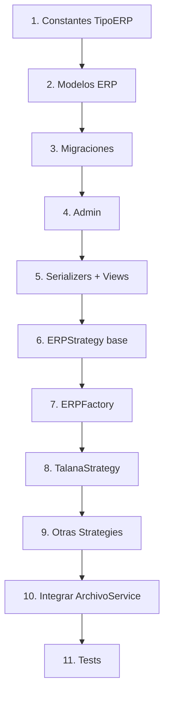

# 🏭 Plan de Implementación: ERP Factory/Strategy

> Issue #20: Crear entidades ERP y ConfiguracionERPCliente con patrones Factory/Strategy

## 📋 Resumen

Implementar una arquitectura extensible que permita soportar **cualquier ERP** (Talana, BUK, SAP, Nubox, Softland, etc.) mediante:
1. **Modelos base**: `ERP` y `ConfiguracionERPCliente`
2. **Patrón Strategy**: Para parseo de archivos específicos de cada ERP
3. **Patrón Factory**: Para instanciar la estrategia correcta dinámicamente

---

## 🎯 Fases de Implementación

### **Fase 1: Modelos Base** (Backend Core)
**Prioridad: ALTA** | Estimado: ~2 horas

| # | Tarea | Archivo | Estado |
|---|-------|---------|--------|
| 1.1 | Crear modelo `ERP` | `backend/apps/core/models/erp.py` | ⬜ |
| 1.2 | Crear modelo `ConfiguracionERPCliente` | `backend/apps/core/models/erp.py` | ⬜ |
| 1.3 | Agregar constante `TipoERP` | `backend/apps/core/constants.py` | ⬜ |
| 1.4 | Exportar modelos | `backend/apps/core/models/__init__.py` | ⬜ |
| 1.5 | Crear migración | `python manage.py makemigrations` | ⬜ |
| 1.6 | Registrar en Admin | `backend/apps/core/admin.py` | ⬜ |
| 1.7 | Crear serializers | `backend/apps/core/serializers/erp.py` | ⬜ |
| 1.8 | Crear ViewSets | `backend/apps/core/views/erp.py` | ⬜ |
| 1.9 | Agregar URLs | `backend/apps/core/urls.py` | ⬜ |

**Archivos nuevos:**
```
backend/apps/core/
├── models/erp.py              # NUEVO
├── serializers/erp.py         # NUEVO
└── views/erp.py               # NUEVO
```

---

### **Fase 2: Factory/Strategy para Validador** (Parseo de archivos)
**Prioridad: ALTA** | Estimado: ~3 horas

| # | Tarea | Archivo | Estado |
|---|-------|---------|--------|
| 2.1 | Crear clase base `ERPStrategy` | `backend/apps/validador/services/erp/base.py` | ⬜ |
| 2.2 | Crear `ERPFactory` | `backend/apps/validador/services/erp/factory.py` | ⬜ |
| 2.3 | Implementar `TalanaStrategy` | `backend/apps/validador/services/erp/talana.py` | ⬜ |
| 2.4 | Implementar `BukStrategy` | `backend/apps/validador/services/erp/buk.py` | ⬜ |
| 2.5 | Implementar `SAPStrategy` | `backend/apps/validador/services/erp/sap.py` | ⬜ |
| 2.6 | Exportar en `__init__.py` | `backend/apps/validador/services/erp/__init__.py` | ⬜ |
| 2.7 | Integrar con `ArchivoService` | `backend/apps/validador/services/archivo_service.py` | ⬜ |

**Estructura de carpetas:**
```
backend/apps/validador/services/
├── erp/                       # NUEVO
│   ├── __init__.py
│   ├── base.py               # ERPStrategy (ABC)
│   ├── factory.py            # ERPFactory
│   ├── talana.py             # TalanaStrategy
│   ├── buk.py                # BukStrategy
│   ├── sap.py                # SAPStrategy
│   └── generic.py            # GenericStrategy (fallback)
├── __init__.py               # Actualizar exports
├── archivo_service.py        # Integrar factory
└── ...
```

---

### **Fase 3: API Clients para Reportería** (Conexión a APIs de ERPs)
**Prioridad: MEDIA** | Estimado: ~2 horas

| # | Tarea | Archivo | Estado |
|---|-------|---------|--------|
| 3.1 | Crear clase base `ERPAPIClient` | `backend/apps/reporteria/services/erp_api/base.py` | ⬜ |
| 3.2 | Crear `ERPAPIFactory` | `backend/apps/reporteria/services/erp_api/factory.py` | ⬜ |
| 3.3 | Implementar `TalanaAPIClient` | `backend/apps/reporteria/services/erp_api/talana.py` | ⬜ |
| 3.4 | Exportar en `__init__.py` | `backend/apps/reporteria/services/erp_api/__init__.py` | ⬜ |

**Estructura de carpetas:**
```
backend/apps/reporteria/services/
├── erp_api/                   # NUEVO
│   ├── __init__.py
│   ├── base.py               # ERPAPIClient (ABC)
│   ├── factory.py            # ERPAPIFactory
│   └── talana.py             # TalanaAPIClient
└── __init__.py               # Actualizar exports
```

---

### **Fase 4: Frontend** (Constantes y UI opcional)
**Prioridad: BAJA** | Estimado: ~1 hora

| # | Tarea | Archivo | Estado |
|---|-------|---------|--------|
| 4.1 | Agregar constantes ERP | `frontend/src/constants/index.js` | ⬜ |
| 4.2 | Crear hook useERP (opcional) | `frontend/src/hooks/useERP.js` | ⬜ |

---

## 📐 Diseño Detallado

### Modelo: ERP
```python
# backend/apps/core/models/erp.py

class ERP(models.Model):
    """
    Catálogo de sistemas ERP soportados por SGM.
    
    Ejemplos: Talana, BUK, SAP, Nubox, Softland, etc.
    
    El campo `slug` se usa como clave para el Factory pattern.
    """
    slug = models.SlugField(
        'Slug',
        max_length=50,
        unique=True,
        help_text='Identificador único para Factory (ej: talana, buk, sap)'
    )
    nombre = models.CharField(
        'Nombre',
        max_length=100,
        help_text='Nombre del sistema ERP'
    )
    descripcion = models.TextField(
        'Descripción',
        blank=True
    )
    activo = models.BooleanField(
        'Activo',
        default=True,
        help_text='Si el ERP está disponible para selección'
    )
    
    # Metadatos técnicos
    requiere_api = models.BooleanField(
        'Requiere API',
        default=False,
        help_text='Si el ERP tiene API para integración directa'
    )
    formatos_soportados = models.JSONField(
        'Formatos Soportados',
        default=list,
        help_text='Lista de extensiones: ["xlsx", "csv", "txt"]'
    )
    schema_credenciales = models.JSONField(
        'Schema de Credenciales',
        default=dict,
        blank=True,
        help_text='JSON Schema para validar credenciales requeridas'
    )
    
    # Configuración de parseo (para Strategy)
    configuracion_parseo = models.JSONField(
        'Configuración de Parseo',
        default=dict,
        blank=True,
        help_text='Config específica: columnas, hojas, delimitadores, etc.'
    )
    
    class Meta:
        verbose_name = 'ERP'
        verbose_name_plural = 'ERPs'
        ordering = ['nombre']
    
    def __str__(self):
        return self.nombre
```

### Modelo: ConfiguracionERPCliente
```python
class ConfiguracionERPCliente(models.Model):
    """
    Configuración de un ERP específico para un Cliente.
    
    Vincula Cliente ↔ ERP con credenciales y vigencia.
    Un cliente puede tener múltiples ERPs pero solo uno activo.
    """
    cliente = models.ForeignKey(
        'Cliente',
        on_delete=models.CASCADE,
        related_name='configuraciones_erp',
        verbose_name='Cliente'
    )
    erp = models.ForeignKey(
        ERP,
        on_delete=models.CASCADE,
        related_name='configuraciones',
        verbose_name='ERP'
    )
    
    # Credenciales (considerar encriptación con django-encrypted-model-fields)
    credenciales = models.JSONField(
        'Credenciales',
        default=dict,
        blank=True,
        help_text='Credenciales específicas: {token, client_id, base_url, etc.}'
    )
    
    # Vigencia
    fecha_activacion = models.DateField(
        'Fecha de Activación',
        help_text='Desde cuándo está activa esta configuración'
    )
    fecha_expiracion = models.DateField(
        'Fecha de Expiración',
        null=True,
        blank=True,
        help_text='Fecha límite (null = sin vencimiento)'
    )
    activo = models.BooleanField(
        'Activo',
        default=True
    )
    
    # Auditoría
    created_at = models.DateTimeField(auto_now_add=True)
    updated_at = models.DateTimeField(auto_now=True)
    
    class Meta:
        verbose_name = 'Configuración ERP de Cliente'
        verbose_name_plural = 'Configuraciones ERP de Clientes'
        constraints = [
            models.UniqueConstraint(
                fields=['cliente', 'erp'],
                name='unique_cliente_erp'
            )
        ]
        ordering = ['cliente', 'erp']
    
    def __str__(self):
        return f"{self.cliente} ↔ {self.erp}"
    
    @property
    def esta_vigente(self) -> bool:
        """Verifica si la configuración está vigente."""
        from django.utils import timezone
        today = timezone.now().date()
        
        if not self.activo:
            return False
        if self.fecha_expiracion and self.fecha_expiracion < today:
            return False
        return self.fecha_activacion <= today
```

---

### Constantes: TipoERP
```python
# backend/apps/core/constants.py (agregar)

class TipoERP:
    """
    Slugs de ERPs soportados.
    
    Estos slugs se usan como identificadores para:
    - El patrón Factory (instanciar estrategias)
    - Validar configuraciones
    - Consistencia frontend/backend
    
    Uso:
        from apps.core.constants import TipoERP
        
        if config.erp.slug == TipoERP.TALANA:
            ...
    """
    TALANA = 'talana'
    BUK = 'buk'
    SAP = 'sap'
    NUBOX = 'nubox'
    SOFTLAND = 'softland'
    GENERIC = 'generic'  # Fallback para ERPs sin implementación específica
    
    CHOICES = [
        (TALANA, 'Talana'),
        (BUK, 'BUK'),
        (SAP, 'SAP'),
        (NUBOX, 'Nubox'),
        (SOFTLAND, 'Softland'),
        (GENERIC, 'Genérico'),
    ]
    
    # ERPs con API disponible
    CON_API = [TALANA, BUK]
    
    # Todos los slugs válidos
    ALL = [TALANA, BUK, SAP, NUBOX, SOFTLAND, GENERIC]
    
    @classmethod
    def es_valido(cls, slug: str) -> bool:
        """Verifica si un slug es válido."""
        return slug in cls.ALL
    
    @classmethod
    def tiene_api(cls, slug: str) -> bool:
        """Verifica si el ERP tiene API para integración."""
        return slug in cls.CON_API
```

---

### Strategy Pattern: ERPStrategy
```python
# backend/apps/validador/services/erp/base.py

from abc import ABC, abstractmethod
from typing import TYPE_CHECKING
import pandas as pd

if TYPE_CHECKING:
    from apps.core.models import ERP


class ERPStrategy(ABC):
    """
    Estrategia base para procesamiento de archivos ERP.
    
    Cada ERP implementa su propia estrategia para:
    - Parsear archivos (xlsx, csv, txt)
    - Normalizar datos a formato común
    - Validar estructura del archivo
    
    Uso:
        strategy = ERPFactory.get_strategy('talana')
        df = strategy.parse_archivo(file)
        formato = strategy.get_formato_esperado()
    """
    
    erp_slug: str = None
    nombre_display: str = None
    
    def __init__(self, erp_config: dict = None):
        """
        Args:
            erp_config: Configuración de parseo del modelo ERP.configuracion_parseo
        """
        self.config = erp_config or {}
    
    @abstractmethod
    def parse_archivo(self, file, tipo_archivo: str) -> pd.DataFrame:
        """
        Parsea un archivo del ERP y retorna DataFrame normalizado.
        
        Args:
            file: Archivo subido (InMemoryUploadedFile o similar)
            tipo_archivo: Tipo de archivo ('libro_remuneraciones', 'centralizado', etc.)
        
        Returns:
            DataFrame con columnas normalizadas
        
        Raises:
            ValueError: Si el archivo no tiene el formato esperado
        """
        pass
    
    @abstractmethod
    def get_formato_esperado(self, tipo_archivo: str) -> dict:
        """
        Retorna el formato esperado del archivo.
        
        Args:
            tipo_archivo: Tipo de archivo
        
        Returns:
            Dict con información del formato:
            {
                'extensiones': ['xlsx', 'xls'],
                'columnas_requeridas': ['RUT', 'Nombre', 'Monto'],
                'hoja': 'Libro',  # opcional
                'fila_header': 0,
                'ejemplo_url': '/docs/formatos/talana_libro.xlsx'
            }
        """
        pass
    
    @abstractmethod
    def validar_estructura(self, df: pd.DataFrame, tipo_archivo: str) -> tuple[bool, list[str]]:
        """
        Valida que el DataFrame tenga la estructura correcta.
        
        Args:
            df: DataFrame a validar
            tipo_archivo: Tipo de archivo
        
        Returns:
            Tuple (es_valido, lista_errores)
        """
        pass
    
    def normalizar_rut(self, rut: str) -> str:
        """Normaliza RUT a formato estándar (sin puntos, con guión)."""
        if not rut:
            return ''
        rut = str(rut).upper().replace('.', '').replace(' ', '')
        if '-' not in rut and len(rut) > 1:
            rut = f"{rut[:-1]}-{rut[-1]}"
        return rut
    
    def normalizar_monto(self, monto) -> float:
        """Convierte monto a float, manejando formatos locales."""
        if pd.isna(monto):
            return 0.0
        if isinstance(monto, (int, float)):
            return float(monto)
        # Limpiar formato chileno: 1.234.567 -> 1234567
        monto_str = str(monto).replace('$', '').replace('.', '').replace(',', '.').strip()
        try:
            return float(monto_str)
        except ValueError:
            return 0.0
```

---

### Factory Pattern: ERPFactory
```python
# backend/apps/validador/services/erp/factory.py

from typing import Type
from .base import ERPStrategy


class ERPFactory:
    """
    Factory para obtener la estrategia de parseo correcta según el ERP.
    
    Las estrategias se registran automáticamente mediante decorador.
    
    Uso:
        # Obtener estrategia
        strategy = ERPFactory.get_strategy('talana')
        df = strategy.parse_archivo(file, 'libro_remuneraciones')
        
        # Con configuración del modelo ERP
        strategy = ERPFactory.get_strategy('talana', erp.configuracion_parseo)
        
        # Listar ERPs registrados
        slugs = ERPFactory.get_registered_slugs()
    """
    
    _strategies: dict[str, Type[ERPStrategy]] = {}
    
    @classmethod
    def register(cls, slug: str):
        """
        Decorador para registrar una estrategia.
        
        Uso:
            @ERPFactory.register('talana')
            class TalanaStrategy(ERPStrategy):
                ...
        """
        def decorator(strategy_class: Type[ERPStrategy]):
            cls._strategies[slug] = strategy_class
            strategy_class.erp_slug = slug
            return strategy_class
        return decorator
    
    @classmethod
    def get_strategy(cls, erp_slug: str, config: dict = None) -> ERPStrategy:
        """
        Obtiene la estrategia para un ERP específico.
        
        Args:
            erp_slug: Slug del ERP (ej: 'talana', 'buk')
            config: Configuración de parseo opcional
        
        Returns:
            Instancia de ERPStrategy
        
        Raises:
            ValueError: Si el ERP no está registrado
        """
        if erp_slug not in cls._strategies:
            # Fallback a estrategia genérica si existe
            if 'generic' in cls._strategies:
                return cls._strategies['generic'](config)
            raise ValueError(
                f"ERP '{erp_slug}' no soportado. "
                f"Disponibles: {list(cls._strategies.keys())}"
            )
        return cls._strategies[erp_slug](config)
    
    @classmethod
    def get_registered_slugs(cls) -> list[str]:
        """Retorna lista de slugs de ERPs registrados."""
        return list(cls._strategies.keys())
    
    @classmethod
    def is_registered(cls, erp_slug: str) -> bool:
        """Verifica si un ERP tiene estrategia registrada."""
        return erp_slug in cls._strategies
```

---

### Ejemplo: TalanaStrategy
```python
# backend/apps/validador/services/erp/talana.py

import pandas as pd
from .base import ERPStrategy
from .factory import ERPFactory


@ERPFactory.register('talana')
class TalanaStrategy(ERPStrategy):
    """
    Estrategia de parseo para archivos de Talana.
    
    Formatos soportados:
    - Libro de Remuneraciones (xlsx)
    - Centralizado de Nómina (xlsx)
    """
    
    nombre_display = 'Talana'
    
    # Mapeo de columnas Talana -> Normalizado
    COLUMNAS_LIBRO = {
        'Rut': 'rut',
        'RUT': 'rut',
        'Nombre Completo': 'nombre',
        'Nombre': 'nombre',
        'Concepto': 'concepto',
        'Tipo Concepto': 'tipo_concepto',
        'Monto': 'monto',
        'Valor': 'monto',
    }
    
    def parse_archivo(self, file, tipo_archivo: str) -> pd.DataFrame:
        """Parsea archivo de Talana."""
        if tipo_archivo == 'libro_remuneraciones':
            return self._parse_libro_remuneraciones(file)
        elif tipo_archivo == 'centralizado':
            return self._parse_centralizado(file)
        else:
            raise ValueError(f"Tipo de archivo no soportado para Talana: {tipo_archivo}")
    
    def _parse_libro_remuneraciones(self, file) -> pd.DataFrame:
        """Parsea Libro de Remuneraciones de Talana."""
        # Talana usa hoja "Libro" o la primera hoja
        try:
            df = pd.read_excel(file, sheet_name='Libro')
        except ValueError:
            df = pd.read_excel(file, sheet_name=0)
        
        # Renombrar columnas
        df = df.rename(columns=self.COLUMNAS_LIBRO)
        
        # Normalizar RUT
        if 'rut' in df.columns:
            df['rut'] = df['rut'].apply(self.normalizar_rut)
        
        # Normalizar montos
        if 'monto' in df.columns:
            df['monto'] = df['monto'].apply(self.normalizar_monto)
        
        return df
    
    def _parse_centralizado(self, file) -> pd.DataFrame:
        """Parsea Centralizado de Talana."""
        df = pd.read_excel(file, sheet_name=0)
        df = df.rename(columns=self.COLUMNAS_LIBRO)
        
        if 'rut' in df.columns:
            df['rut'] = df['rut'].apply(self.normalizar_rut)
        if 'monto' in df.columns:
            df['monto'] = df['monto'].apply(self.normalizar_monto)
        
        return df
    
    def get_formato_esperado(self, tipo_archivo: str) -> dict:
        """Retorna formato esperado para Talana."""
        if tipo_archivo == 'libro_remuneraciones':
            return {
                'extensiones': ['xlsx', 'xls'],
                'columnas_requeridas': ['Rut', 'Nombre Completo', 'Concepto', 'Monto'],
                'hoja': 'Libro (o primera hoja)',
                'fila_header': 0,
            }
        elif tipo_archivo == 'centralizado':
            return {
                'extensiones': ['xlsx', 'xls'],
                'columnas_requeridas': ['Rut', 'Nombre', 'Concepto', 'Valor'],
                'hoja': 'Primera hoja',
                'fila_header': 0,
            }
        return {}
    
    def validar_estructura(self, df: pd.DataFrame, tipo_archivo: str) -> tuple[bool, list[str]]:
        """Valida estructura del DataFrame."""
        errores = []
        formato = self.get_formato_esperado(tipo_archivo)
        
        # Verificar columnas requeridas
        columnas_normalizadas = [self.COLUMNAS_LIBRO.get(c, c.lower()) for c in formato.get('columnas_requeridas', [])]
        for col in columnas_normalizadas:
            if col not in df.columns:
                errores.append(f"Columna faltante: {col}")
        
        # Verificar que no esté vacío
        if df.empty:
            errores.append("El archivo no contiene datos")
        
        return len(errores) == 0, errores
```

---

## 🔄 Flujo de Integración

### Cómo se usa en ArchivoService:

```python
# backend/apps/validador/services/archivo_service.py

from .erp import ERPFactory

class ArchivoService:
    
    @staticmethod
    def procesar_archivo_erp(cierre, archivo, tipo_archivo: str, user):
        """Procesa un archivo ERP usando la estrategia correcta."""
        
        # 1. Obtener configuración ERP del cliente
        config_erp = cierre.cliente.configuraciones_erp.filter(
            activo=True
        ).select_related('erp').first()
        
        if not config_erp:
            return ServiceResult.error("Cliente no tiene ERP configurado")
        
        # 2. Obtener estrategia mediante Factory
        try:
            strategy = ERPFactory.get_strategy(
                config_erp.erp.slug,
                config_erp.erp.configuracion_parseo
            )
        except ValueError as e:
            return ServiceResult.error(str(e))
        
        # 3. Parsear archivo
        try:
            df = strategy.parse_archivo(archivo, tipo_archivo)
        except Exception as e:
            return ServiceResult.error(f"Error parseando archivo: {e}")
        
        # 4. Validar estructura
        es_valido, errores = strategy.validar_estructura(df, tipo_archivo)
        if not es_valido:
            return ServiceResult.error(
                "Archivo con estructura inválida",
                errors={'estructura': errores}
            )
        
        # 5. Procesar datos normalizados...
        return ServiceResult.success(df)
```

---

## ✅ Criterios de Aceptación

1. ✅ Poder crear/editar ERPs desde Django Admin
2. ✅ Poder asignar un ERP a un Cliente con sus credenciales
3. ✅ El sistema determina automáticamente el formato de archivo según el ERP del cliente
4. ✅ Factory retorna la estrategia correcta según el slug del ERP
5. ✅ Credenciales almacenadas de forma segura (JSONField)
6. ✅ Validación de vigencia de configuración (fecha_activacion, fecha_expiracion)
7. ✅ Fallback a estrategia genérica si el ERP no tiene implementación específica

---

## 📝 Orden de Implementación Recomendado



---

## 🧪 Tests Sugeridos

```python
# backend/apps/validador/tests/test_erp_factory.py

class TestERPFactory:
    def test_get_talana_strategy(self):
        strategy = ERPFactory.get_strategy('talana')
        assert isinstance(strategy, TalanaStrategy)
    
    def test_unknown_erp_raises_error(self):
        with pytest.raises(ValueError, match="no soportado"):
            ERPFactory.get_strategy('erp_inexistente')
    
    def test_fallback_to_generic(self):
        strategy = ERPFactory.get_strategy('nuevo_erp')
        assert isinstance(strategy, GenericStrategy)


class TestTalanaStrategy:
    def test_parse_libro_remuneraciones(self, talana_libro_file):
        strategy = TalanaStrategy()
        df = strategy.parse_archivo(talana_libro_file, 'libro_remuneraciones')
        
        assert 'rut' in df.columns
        assert 'monto' in df.columns
        assert df['monto'].dtype == float
    
    def test_normalizar_rut(self):
        strategy = TalanaStrategy()
        assert strategy.normalizar_rut('12.345.678-9') == '12345678-9'
        assert strategy.normalizar_rut('123456789') == '12345678-9'
```

---

## 📅 Estimación Total

| Fase | Estimación |
|------|------------|
| Fase 1: Modelos Base | ~2 horas |
| Fase 2: Factory/Strategy | ~3 horas |
| Fase 3: API Clients | ~2 horas |
| Fase 4: Frontend | ~1 hora |
| Tests | ~2 horas |
| **Total** | **~10 horas** |

---

## 🚀 Próximos Pasos

1. ¿Comenzamos con **Fase 1** (Modelos)?
2. ¿O prefieres revisar/ajustar el plan primero?

---

*Generado: 2026-01-08 | Issue #20*
